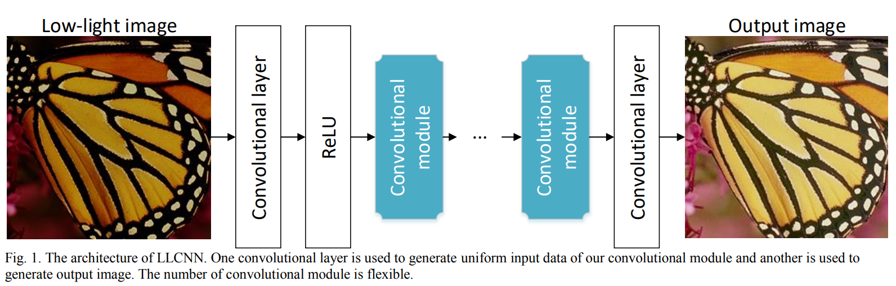
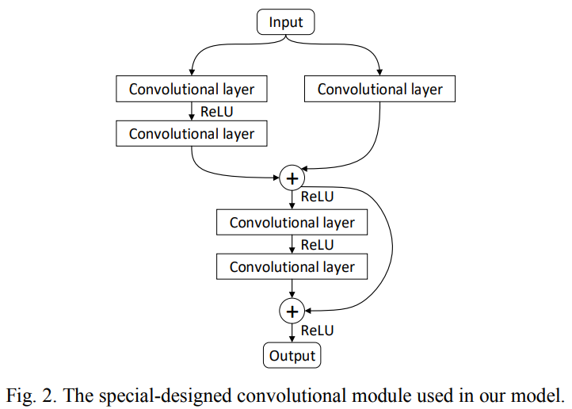

# LLCNN
This is the training code for [LLCNN: A convolutional neural network for low-light image enhancement](https://ieeexplore.ieee.org/abstract/document/8305143).   
The code can be used in caffe. The official version of caffe may not support SSIM loss function. You need to add SSIM loss layer or just use [this](https://github.com/onalbach/caffe-deep-shading).

## Network Architecture 
We use one convolutional layer to do pre-processing and another convolutional layer to fuse feature maps and generate the output image. Several special-designed convolutional modules are placed between these two convolutional layers.
 
### Special designed module
The several special-designed convolutional module is inspired by residual learning. The architecture is shown as follows.   
   

## Data
The training images are the same as VDSR, which can be downloaded using this [URL](http://cv.snu.ac.kr/research/VDSR/train_data.zip).  Other image processing datasets can be used to generate training and testing data. Here are some datasets usually used in image processing cmmunity: [Set 5](https://uofi.box.com/shared/static/kfahv87nfe8ax910l85dksyl2q212voc.zip)/
[Set 14](https://uofi.box.com/shared/static/igsnfieh4lz68l926l8xbklwsnnk8we9.zip)/
[Urban100](https://uofi.box.com/shared/static/65upg43jjd0a4cwsiqgl6o6ixube6klm.zip)/
[BSD100](https://uofi.box.com/shared/static/qgctsplb8txrksm9to9x01zfa4m61ngq.zip)

## Citing LLCNN
If you find LLCNN useful in your research, please consider citing:
```
@INPROCEEDINGS{8305143, 
    author={L. Tao and C. Zhu and G. Xiang and Y. Li and H. Jia and X. Xie}, 
	booktitle={2017 IEEE Visual Communications and Image Processing (VCIP)}, 
	title={LLCNN: A convolutional neural network for low-light image enhancement}, 
	year={2017}
```